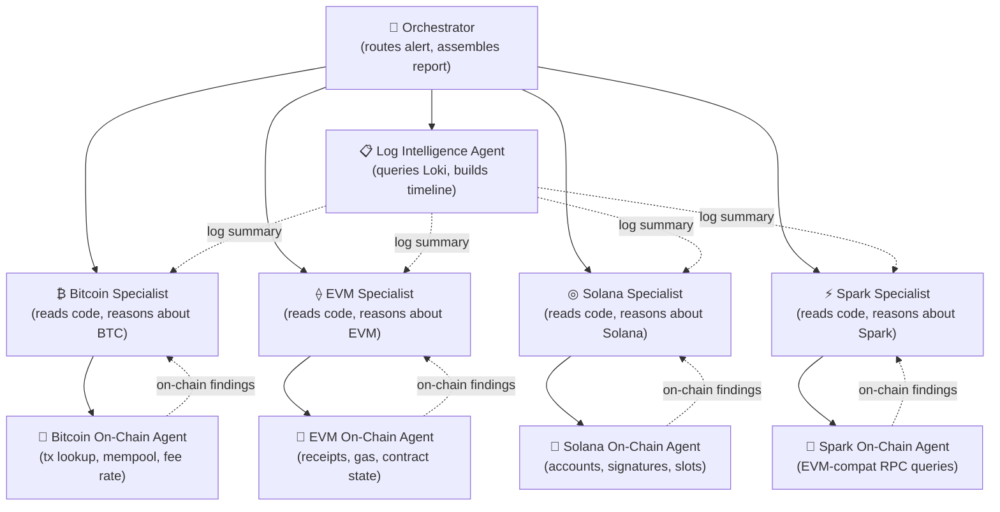
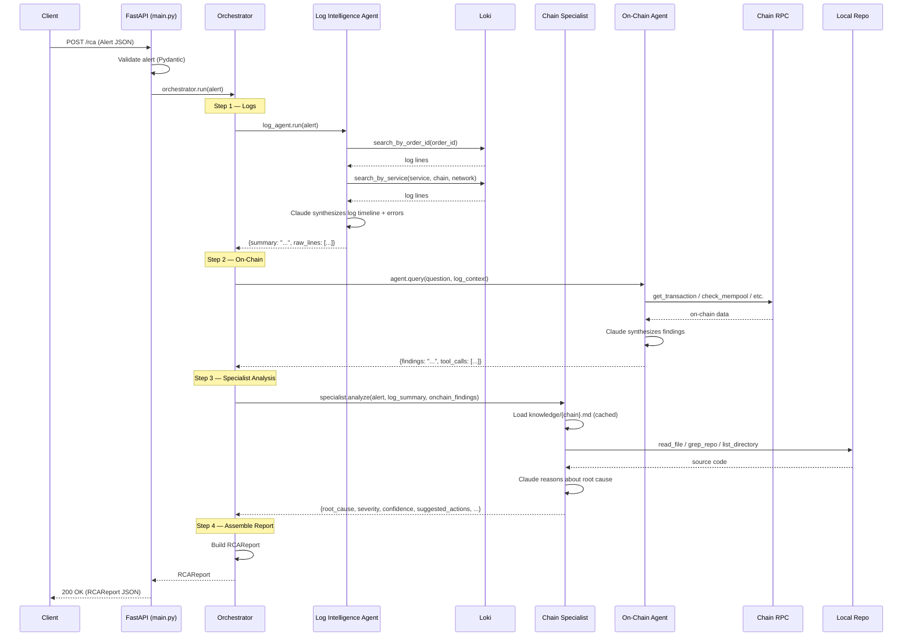
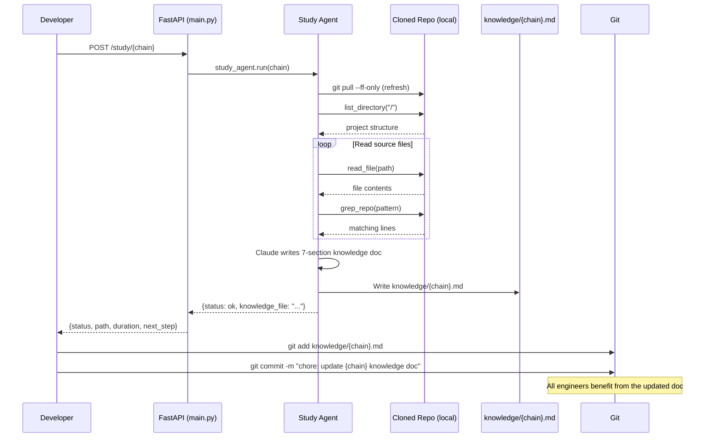
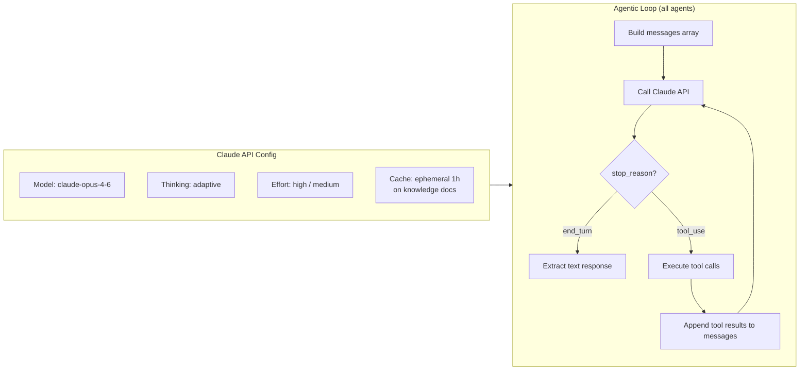
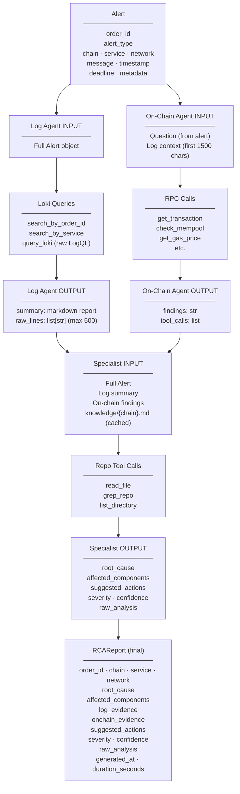
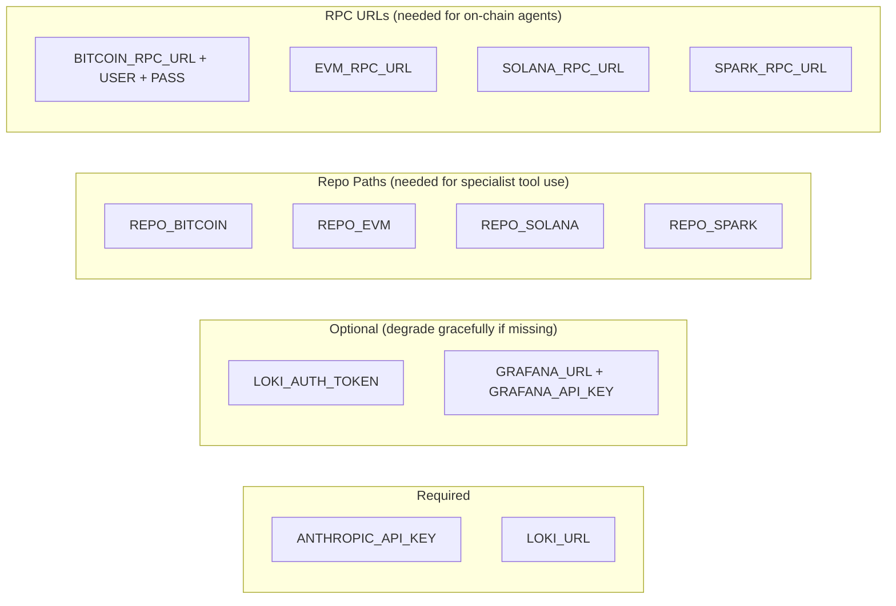

# Garden RCA Agent — Architecture

> Automated Root Cause Analysis for Garden cross-chain bridge alerts.
> When an alert fires, this system replaces the on-call debug loop with a pipeline of
> specialized AI agents that query logs, inspect on-chain state, read source code,
> and return a structured RCA report in seconds.

---

## Table of Contents

1. [System Overview](#1-system-overview)
2. [Agent Hierarchy](#2-agent-hierarchy)
3. [RCA Request Flow](#3-rca-request-flow)
4. [Study Mode Flow](#4-study-mode-flow)
5. [Agent Detail — Internals](#5-agent-detail--internals)
6. [Data Flow — What Each Agent Receives and Returns](#6-data-flow--what-each-agent-receives-and-returns)
7. [File Structure](#7-file-structure)
8. [Configuration & Environment](#8-configuration--environment)
9. [How to Train the Agents](#9-how-to-train-the-agents)
10. [Adding a New Chain](#10-adding-a-new-chain)

---

## 1. System Overview

```mermaid
graph TB
    subgraph External["External Triggers"]
        ALERT[Alert / Webhook<br/>POST /rca]
        STUDY_TRIGGER[Manual Trigger<br/>POST /study/{chain}]
    end

    subgraph API["FastAPI Server"]
        MAIN[main.py<br/>Route + Validate]
    end

    subgraph Pipeline["RCA Pipeline"]
        ORCH[Orchestrator<br/>agents/orchestrator.py]
        LOG[Log Intelligence Agent<br/>agents/log_agent.py]
        SPEC[Chain Specialist<br/>agents/specialists/{chain}.py]
        ONCHAIN[On-Chain Agent<br/>agents/onchain/{chain}.py]
    end

    subgraph DataSources["Data Sources"]
        LOKI[(Loki<br/>Log Storage)]
        RPC[(Chain RPC<br/>Bitcoin / EVM / Solana / Spark)]
        REPO[(Cloned Repos<br/>Local Filesystem)]
        KNOWLEDGE[(knowledge/{chain}.md<br/>Generated KT Docs)]
    end

    subgraph StudyPipeline["Study Mode"]
        STUDY[Study Agent<br/>study/study_agent.py]
    end

    subgraph Output["Output"]
        REPORT[RCAReport JSON<br/>root_cause · evidence · actions · severity]
        KT_DOC[knowledge/{chain}.md<br/>Committed to Git]
    end

    ALERT --> MAIN
    STUDY_TRIGGER --> MAIN
    MAIN --> ORCH
    MAIN --> STUDY

    ORCH --> LOG
    ORCH --> SPEC
    SPEC --> ONCHAIN

    LOG --> LOKI
    ONCHAIN --> RPC
    SPEC --> REPO
    SPEC --> KNOWLEDGE

    STUDY --> REPO
    STUDY --> KT_DOC

    ORCH --> REPORT
```

---

## 2. Agent Hierarchy



Only the specialist matching the alert's `chain` field is activated per request.

---

## 3. RCA Request Flow



---

## 4. Study Mode Flow

Triggered manually when source code changes. Generates `knowledge/{chain}.md` — the KT doc injected into the specialist's system prompt.



### Knowledge Doc Structure (7 Sections)

| # | Section | Purpose |
|---|---------|---------|
| 1 | Service Architecture Overview | How executor/watcher/relayer interact, order lifecycle |
| 2 | Key Files and Their Roles | Entry points, core business logic, config |
| 3 | Critical Functions | initiate, redeem, refund, fee estimation, retry logic |
| 4 | Known Failure Patterns | Error messages, conditions that trigger each failure |
| 5 | Important Constants & Thresholds | Timeouts, fee floors, retry counts, magic numbers |
| 6 | Log Signatures | What log lines mean, transient vs. fatal errors |
| 7 | On-Chain Checks per Failure Type | What to verify on-chain for each alert_type |

---

## 5. Agent Detail — Internals

Every agent runs a **manual agentic loop** — no SDK auto-runner. This gives full control over error handling and graceful degradation.



### Effort Levels by Agent

| Agent | Effort | Reasoning |
|-------|--------|-----------|
| Chain Specialist | `high` | Core diagnosis — needs deep reasoning |
| Orchestrator synthesis | `high` | Final assembly from multiple sources |
| Log Intelligence Agent | `medium` | Pattern matching, less complex |
| On-Chain Agent | `medium` | Tool execution + summarization |
| Study Agent | `high` | Deep code comprehension pass |

---

## 6. Data Flow — What Each Agent Receives and Returns



---

## 7. File Structure

```
rca-agent/
├── main.py                          # FastAPI server, /rca and /study/{chain} endpoints
├── config.py                        # Pydantic Settings, loads from .env
├── requirements.txt
├── .env.example                     # Template for all required env vars
│
├── models/
│   ├── alert.py                     # Alert (input model)
│   └── report.py                    # RCAReport (output model)
│
├── tools/
│   ├── loki.py                      # Loki HTTP API client + 3 Claude tool definitions
│   └── repo.py                      # Repo reader (read_file, grep_repo, list_directory)
│
├── agents/
│   ├── orchestrator.py              # Routes alert → agents, assembles RCAReport
│   ├── log_agent.py                 # Log Intelligence Agent (Loki queries)
│   │
│   ├── specialists/
│   │   ├── base.py                  # BaseSpecialist (agentic loop + repo tools)
│   │   ├── bitcoin.py               # Bitcoin Specialist
│   │   ├── evm.py                   # EVM Specialist
│   │   ├── solana.py                # Solana Specialist
│   │   └── spark.py                 # Spark Specialist
│   │
│   └── onchain/
│       ├── base.py                  # BaseOnChainAgent (agentic loop)
│       ├── bitcoin.py               # Bitcoin RPC agent (5 tools)
│       ├── evm.py                   # EVM web3.py agent (5 tools)
│       ├── solana.py                # Solana JSON-RPC agent (4 tools)
│       └── spark.py                 # Spark JSON-RPC agent (3 tools)
│
├── study/
│   └── study_agent.py               # Reads repo → generates knowledge/{chain}.md
│
├── prompts/                         # Override specialist system prompts here
│   └── (empty — add {chain}_specialist.txt to override Python defaults)
│
├── knowledge/                       # Auto-generated by POST /study/{chain}
│   └── (populated after study mode runs — commit these to git)
│
└── incidents/                       # Historical incident patterns (feed later)
    └── (add {chain}.yaml as incidents accumulate)
```

---

## 8. Configuration & Environment

All configuration is in `.env` (see `.env.example`):



---

## 9. How to Train the Agents

The agents start with sensible baselines built into their Python code. To make them Garden-specific:

### Step 1 — Run Study Mode (per chain)

```bash
curl -X POST http://localhost:8000/study/bitcoin
curl -X POST http://localhost:8000/study/evm
curl -X POST http://localhost:8000/study/solana
curl -X POST http://localhost:8000/study/spark
```

This reads the cloned repo, generates `knowledge/{chain}.md`, and caches it in specialist prompts.

### Step 2 — Commit the Knowledge Docs

```bash
git add knowledge/
git commit -m "chore: initial chain knowledge docs from study mode"
git push
```

All engineers and the agent immediately benefit.

### Step 3 — Write Custom Specialist Prompts (optional, after enough incidents)

Create `prompts/{chain}_specialist.txt` with Garden-specific system prompt text.
The specialist will load this file in preference to its Python default.

### Step 4 — Feed Past Incidents

Add entries to `incidents/{chain}.yaml` and re-run study mode.
The study agent will read past incidents and focus on related code paths.

---

## 10. Adding a New Chain

1. **On-Chain Agent** — create `agents/onchain/{chain}.py` extending `BaseOnChainAgent`
   - Implement `chain`, `tool_definitions`, `execute_tool`
   - Add it to `_ONCHAIN_AGENTS` in `orchestrator.py`

2. **Specialist** — create `agents/specialists/{chain}.py` extending `BaseSpecialist`
   - Implement `chain`, `system_prompt` (or add a `prompts/{chain}_specialist.txt`)
   - Add it to `_SPECIALISTS` in `orchestrator.py`

3. **Config** — add `repo_{chain}` and `{chain}_rpc_url` to `config.py`

4. **Models** — add the new chain name to the `Literal` union in `models/alert.py`

5. **Study** — run `POST /study/{chain}` to generate the knowledge doc

6. **Endpoints** — add the chain to `SUPPORTED_CHAINS` in `main.py`

---

## API Reference

### `POST /rca`

Trigger a full RCA for an alert.

**Request body (`Alert`):**
```json
{
  "order_id": "ord_abc123",
  "alert_type": "deadline_approaching",
  "chain": "bitcoin",
  "service": "executor",
  "network": "mainnet",
  "message": "Order approaching deadline with no init on destination",
  "timestamp": "2026-04-07T10:00:00Z",
  "deadline": "2026-04-07T10:30:00Z",
  "metadata": {}
}
```

**Response (`RCAReport`):**
```json
{
  "order_id": "ord_abc123",
  "chain": "bitcoin",
  "service": "executor",
  "network": "mainnet",
  "root_cause": "Fee rate (1 sat/vbyte) was below mempool minimum (8 sat/vbyte) at broadcast time. Transaction never entered mempool.",
  "affected_components": ["fee_estimator", "broadcaster"],
  "log_evidence": ["fee_rate=1 mempool_min_fee=8", "broadcast: transaction rejected"],
  "onchain_evidence": {"findings": "Transaction hash not found in mempool or chain.", "tool_calls_count": 2},
  "suggested_actions": [
    "Raise the minimum fee floor in fee_estimator.go:45",
    "Implement dynamic fee multiplier based on mempool congestion",
    "Add mempool acceptance check before returning from broadcaster"
  ],
  "severity": "high",
  "confidence": "high",
  "raw_analysis": "...",
  "generated_at": "2026-04-07T10:00:45Z",
  "duration_seconds": 42.1
}
```

### `POST /study/{chain}`

Generate or refresh the knowledge doc for a chain.

**Response:**
```json
{
  "status": "ok",
  "chain": "bitcoin",
  "knowledge_file": "/opt/rca-agent/knowledge/bitcoin.md",
  "duration_seconds": 87.4,
  "next_step": "git add knowledge/bitcoin.md && git commit -m 'chore: update bitcoin knowledge doc'"
}
```

### `GET /health`

```json
{"status": "ok", "chains": ["bitcoin", "evm", "solana", "spark"]}
```
